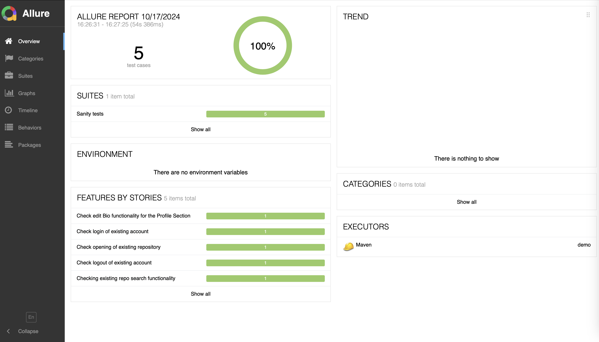
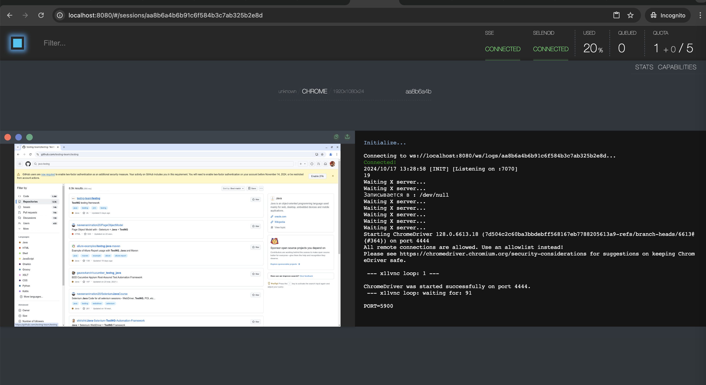

# Github Demo Selenium Automation Project

## Execution instruction

#### Option 1: Simple execution with default Webdriver

```bash
clean install -Denv=test -Dbrowser=chrome -Dusername=your_email_github -Dpassword=your_password allure:serve
```
After the execetion Maven will redirect to browser for Allure Report demonstartion

Default tests configuration is described inside ```testng.xml```, that supports execute 3 browsers in parallel mode

#### Option 2: Execution with Selenoid Docker support

1. Open terminal, navigate to ```src/test/resources``` folder
2. Folder contains ```browsers.json``` and ```docker-compose.yml``` properties, that describes ```Selenoid``` server config
3. For tests ```LoginSuite```, ```ProfileSuite```, ```RepositoriesSuite``` change extends to ```SelenoidSetup.class```
4. Run 
```bash
   clean install -Denv=test -Dbrowser=chrome -Dusername=your_email_github -Dpassword=your_password 
```
5. Navigate to ```localhost:8080``` to see real time docker execution
6. 